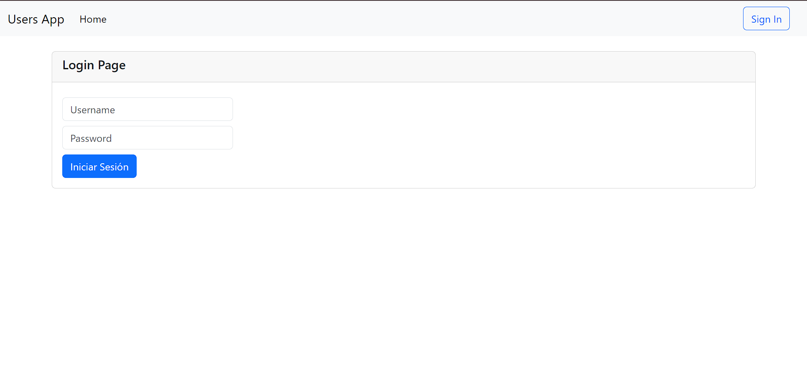
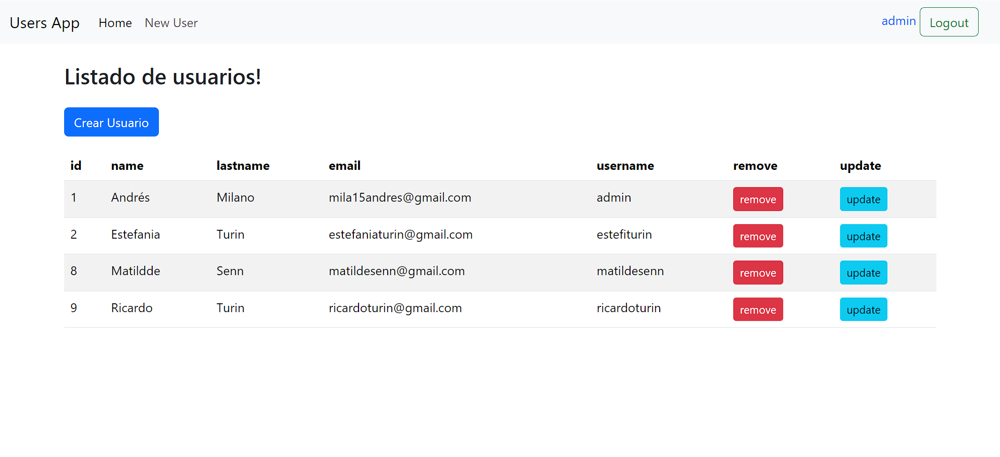
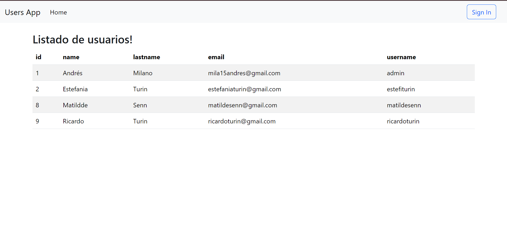
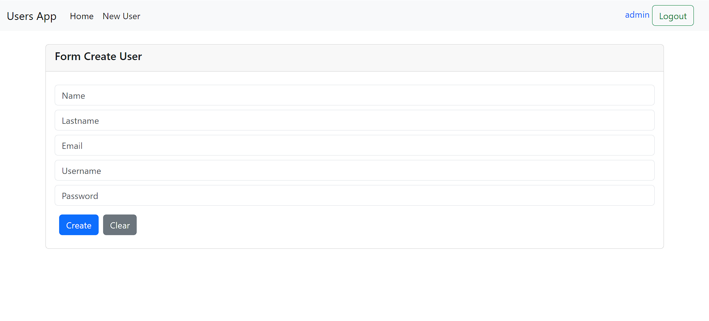

# UserApp - Gestión de usuarios

UserApp es una aplicación de gestión de usuarios que permite a los administradores y usuarios normales realizar diversas operaciones relacionadas con la gestión de usuarios. La aplicación está diseñada para ser segura y fácil de usar, con un frontend desarrollado en Angular y TypeScript, y un backend desarrollado en Spring. Se utiliza JWT Token para gestionar la seguridad y las credenciales de los usuarios.

## Características

- **Roles de Usuario:** La aplicación cuenta con dos roles principales: usuario y administrador. Cada rol tiene diferentes permisos y funcionalidades dentro del sistema.
- **Gestión de Usuarios:** Los administradores pueden realizar operaciones como crear, actualizar, eliminar y ver detalles de los usuarios.
- **Seguridad:** Se implementa seguridad a través de JWT Token para garantizar que solo los usuarios autorizados puedan acceder a las funcionalidades de la aplicación.

## Capturas de Pantalla

A continuación se muestran algunas capturas de pantalla de la interfaz de usuario de UserApp:

*Página de Inicio de Sesión*

*Panel de Administrador*

*Panel del usuario común*

*Crear nuevo usuario*

